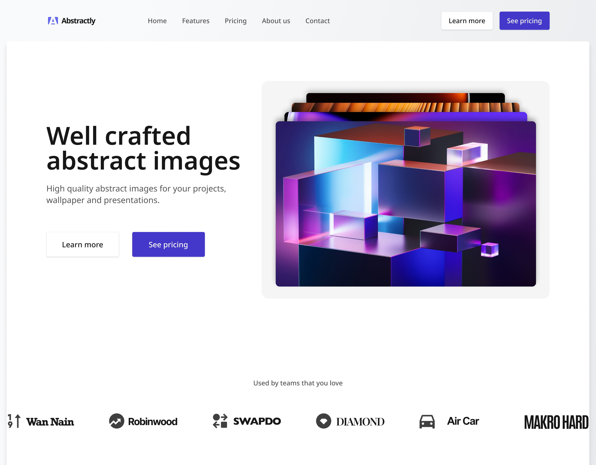

# 🟪 Marketing Landing Page (React + TypeScript)

_A sleek and responsive marketing landing page built with **React + TypeScript**, styled with **TailwindCSS**, animated with **Motion**, and validated with **Zod** for runtime safety._

Data is separated from presentation and mocked to mimic an API for clean architecture and future scalability.



[Live Preview](https://ah-ibrahim.github.io/Marketing-landing-page/)

---

## 📋 Table of Contents

- [About](#-about)
- [Tech Stack](#%EF%B8%8F-tech-stack)
- [Features](#-features)
- [Getting Started](#%EF%B8%8F-getting-started)
- [Project Structure](#project-structure)
- [License](#-license)
- [Credits](#-credits)
- [Authors](#%EF%B8%8F-authors)

---

## 👋 About

This project is a modern marketing landing page **designed with best practices** in frontend engineering:

- Strong type safety with TypeScript

- Runtime schema validation using Zod to ensure reliable data handling

- Clear separation of presentation and data, simulating API-driven architecture

- Smooth animations and transitions powered by Motion

- Fully responsive and styled with TailwindCSS

---

## 🛠️ Tech Stack

Here’s what’s under the hood:

- **React + TypeScript** – component-based UI with static type safety

- **TailwindCSS** – utility-first CSS framework for fast styling

- **Motion** – animations and transitions

- **Zod** – runtime schema validation for data

- **Mocked API Layer** – data separated from UI to mimic API-driven development

---

## ✨ Features

Some cool stuff this project can do:

- 📱 Responsive design with mobile first approach

- 🎨 Modern UI built with TailwindCSS

- 🔒 Type safety at compile-time with TypeScript

- ✅ Runtime safety with Zod schema validation

- 🚀 Reusable components separated from data

- 🎬 Smooth animations with Framer Motion

---

## ⚙️ Getting Started

Wanna run this locally? Follow these steps:

1. Clone the repo

```bash
git clone https://github.com/Ah-Ibrahim/Marketing-landing-page.git
cd your-repo
```

2. Install dependencies

```bash
npm install
```

3. Start the app

```bash
npm run dev
```

---

## Project Structure

```
marketing-landing-page/
├── public/              # Static assets
├── src/
|   ├─ assets/           # Components assets
│   ├── components/      # UI components (presentation only)
│   ├── data/            # Mocked API-like data
│   ├── types/           # Zod schemas for validation
│   ├── pages/           # Page-level components
│   ├── hooks/           # Custom hooks
│   ├── mappers/         # Mapper functions
│   └── main.tsx         # App entry point
├── tailwind.config.js   # Tailwind config
├── tsconfig.json        # TypeScript config
└── package.json
```

---

## 📄 License

This project is licensed under the MIT License.
Feel free to do what you want with it.

---

## 🙏 Credits

Big thanks to:

- Design from [GreatFrontEnd](https://www.greatfrontend.com/projects/)
- Icons from [Remix](https://remixicon.com/)

---

## ✍️ Authors

Ahmed Ibrahim
